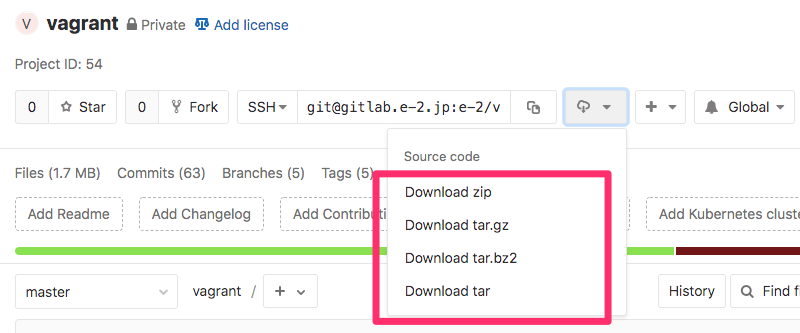

<!-- END doctoc generated TOC please keep comment here to allow auto update -->

# 開発用Vagrant

- [0. 開発用のディレクトリ準備](#0-%E9%96%8B%E7%99%BA%E7%94%A8%E3%81%AE%E3%83%87%E3%82%A3%E3%83%AC%E3%82%AF%E3%83%88%E3%83%AA%E6%BA%96%E5%82%99)
- [1. site.yml を設定](#1-siteyml-%E3%82%92%E8%A8%AD%E5%AE%9A)
- [2.  hosts ファイルの修正](#2-hosts-%E3%83%95%E3%82%A1%E3%82%A4%E3%83%AB%E3%81%AE%E4%BF%AE%E6%AD%A3)
- [3. vagrant up](#3-vagrant-up)
- [4. ブラウザでアクセス](#4-%E3%83%96%E3%83%A9%E3%82%A6%E3%82%B6%E3%81%A7%E3%82%A2%E3%82%AF%E3%82%BB%E3%82%B9)
- [メール送信の確認](#%E3%83%A1%E3%83%BC%E3%83%AB%E9%80%81%E4%BF%A1%E3%81%AE%E7%A2%BA%E8%AA%8D)
- [provision-pre.sh.sample, provision-post.sh.sample](#provision-preshsample-provision-postshsample)
- [Make](#make)
- [他の案件と設定が被った場合](#%E4%BB%96%E3%81%AE%E6%A1%88%E4%BB%B6%E3%81%A8%E8%A8%AD%E5%AE%9A%E3%81%8C%E8%A2%AB%E3%81%A3%E3%81%9F%E5%A0%B4%E5%90%88)
- [その他](#%E3%81%9D%E3%81%AE%E4%BB%96)


## 0. 開発用のディレクトリ準備

以下のようなディレクトリ構成を想定しています

```
└── repo/
    ├── src/  CakePHP等のソース
    └── vagrant/ このディレクトリ
```

ファイルをダウンロード、解凍して repo/vagrant にリネームします




## 1. site.yml を設定

- vagrant/site.yml.sample を vagrant/site.yml にコピーして設定を書き換えます
- vagrant/site.yml は、vagrant/provision/default.yml の設定を上書きするので、
必要に応じて、vagrant/provision/default.yml の設定を vagrant/site.yml にコピーして設定を変更してください
- site.yml をバージョン管理する場合は、.gitignore から削除します


### 1)  ホスト名を案件名に応じて変更します

```
hostname: vagrant.local
```

hostname は、VirtualBox の名前、dev.conf の ServerName に設定されます

** hostname にアンダーバーは使用できません **


### 2) IPアドレスを適宜変更します

```
ip: 192.168.10.10
```

### 3) 使用するデータベースを設定します

```
use_mysql: true
use_pgsql: false
```

### 4) データベースのユーザ名、パスワード、データベース名、テスト用データベース名を書き変えます


```
db_name: vagrant_develop
db_name_test: vagrant_test
db_user: vagrant
db_password: vagrant
```

### 5) インストールしたいPHPのバージョンを指定します


```
php_version: 73
```

### 6) インストールするフレームワークを設定します

CakePHP の場合

```
use_cakephp: true

```
Lravelの場合

```
use_laravel: true
```

すでに、フレームワーク等がインストールされている場合は、`false` に設定します


### 7) ドキュメントルートのパスを案件の構造に合うように書き変えます


```
document_root: /srv/httpd/webroot
```

## 2.  hosts ファイルの修正

site.yml の設定が以下の場合
- hostname: vagrant.local
- ip: 192.168.10.10

hosts ファイルに以下の設定を追加します

```
192.168.10.10 vagrant.local
```


- [【Windows】hostsファイルとは、hostsファイルの場所、hostsファイルの編集・書き換え方法 | onocom](http://onocom.net/blog/windows-hosts-file/)
- [macでhostsファイルを書き換える3つの方法【保存版】 | oku-log](https://oku-log.com/blog/mac-hosts/)


## 3. vagrant up

```
$ cd vagrant
$ vagrant up
```

## 4. ブラウザでアクセス

以下のアドレスにアクセス

https://設定したホスト名/  
または  
http://設定したホスト名/


## メール送信の確認

[MailCatcher](https://mailcatcher.me/) を使用しているので、以下のアドレスから確認可能です

http://設定したホスト名:1080/

## provision-pre.sh.sample, provision-post.sh.sample

それぞれ、 provision-pre.sh, provision-post.sh にリネームして使用します。

### provision-pre.sh

Ansible のプロビジョニングの前に実行されます

### provision-post.sh

Ansible のプロビジョニングの後に実行されます  
主にマイグレーションの実行等に使用します


## Make

Make のタスクを用意しています

[windowsでmakeコマンドを使用する方法](http://note.mokuzine.net/win-make-cmd/)

### ユニットテストの実行

CakePHP のテストを想定しています  
実行するコマンドを変更する場合は、Makefile の `TEST_CMD` を修正してください

```
$ make 
```

or

```
$ make test
```

group 指定
```
$ make group=foo
```

### [php-cs-fixer](https://github.com/FriendsOfPHP/PHP-CS-Fixer) の実行

Makefile の `PHP_SRC` を変更して修正対象のディレクトリを設定してください

dry-run

```
$ make check
```

fixer 実行

```
$ make fix
```

PHP7.1 以上の場合、デフォルトで以下のルールを元にしたものを使用しています  
[suin/php-cs-fixer-rules](https://github.com/suin/php-cs-fixer-rules)

設定ファイルの場所は以下になります
```
 /home/vagrant/.composer/config/.php_cs.dist 
```

PHP7.1 未満では上記ルールはインストールされないので、適宜対応してださい

コマンド実行オプション等を変更したい場合は、Makefile の `CHECK_CMD`, `FIX_CMD` を修正してください

### vagrant 関連

vagrant up

```
$ make up
```

vagrant halt

```
$ make down
```

vagrant destroy -f

```
$ make destroy
```


## 他の案件と設定が被った場合

IPアドレス、ホスト名は、dotenv を使用して変更可能可能です
[dotenvを利用して環境ごとでVagrantfileの設定値を変更してみる](http://blog.glidenote.com/blog/2014/02/26/vagrant-dotenv/)

```.env
VAGRANT_HOSTNAME = 'example.local'
VAGRANT_IP = '192.168.100.100'
```

## その他

- CentOS7 系 使用しているboxは以下  
https://app.vagrantup.com/oppara/boxes/CentOS-7-dev
- 対応しているフレームワークは以下
    - CakePHP 3.x (2.x 系は未対応)
    - Lravel 5.x
